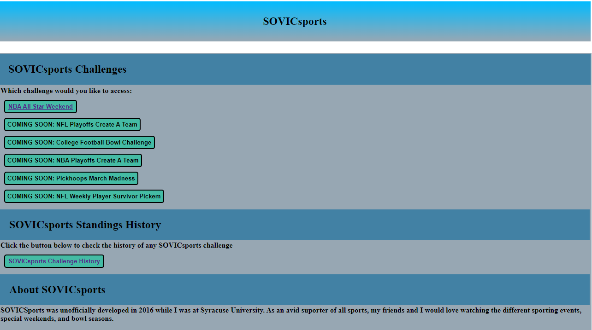
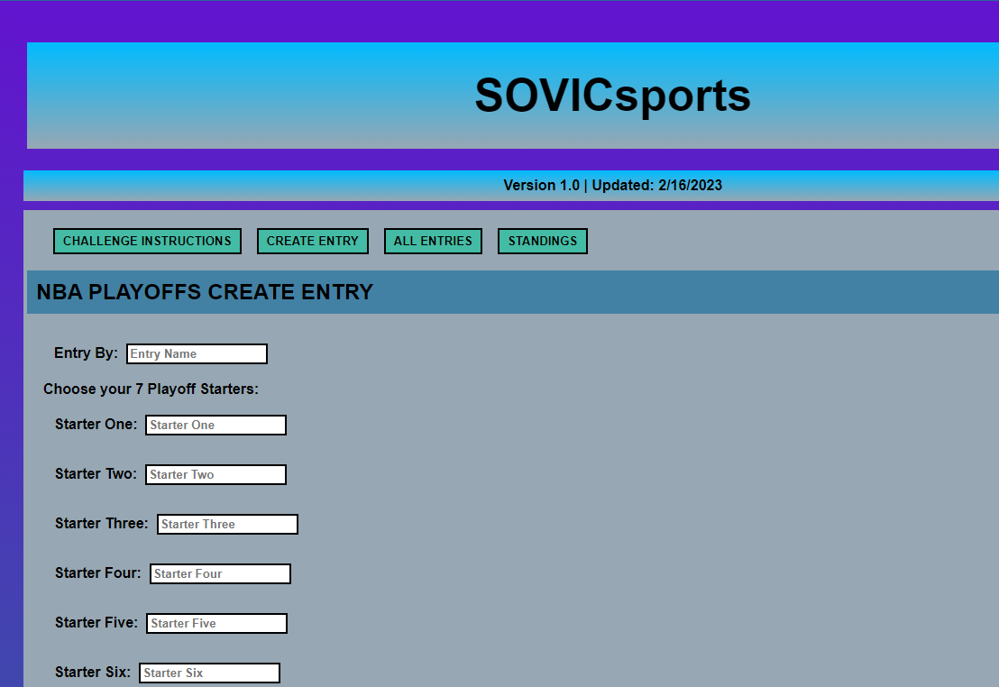
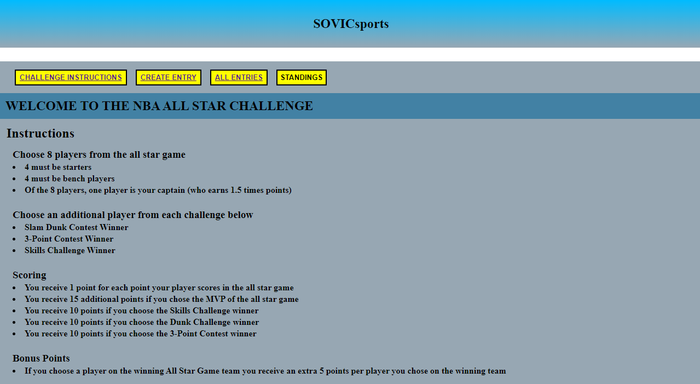
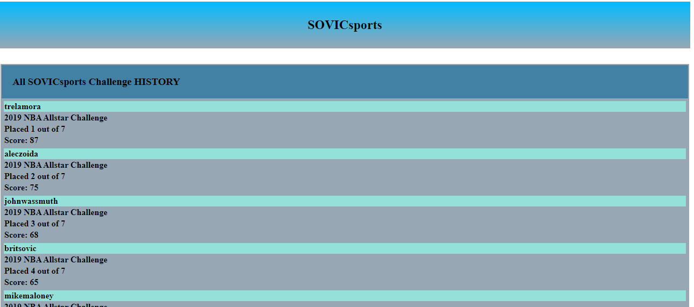

# SOVICsports

## Table of Contents

[Description](#description)

[Tools](#tools)

[Deployed_Application](#deployed-application)

[Future_Developments](#future-developments)

[Screenshots](#screenshots)

## Description

My friends and I enjoy watching sports and all the major special sports events such as the NBA All Star Game, College Football Bowl Season, NFL Playoffs, and more. I created individual event challenges to use my SAS coding skills and allow us to have a fun competition to see who could score the most "challenge points" in each event. These challenges were started back in 2016 and run via excel templates and constantly re running SAS coding scripts to provide updates.

This application was developed to replace the necessity to wait for me for updates and the mass entry system. The application allows the user to enter their entry into the system and access standings automatically whenever the application is accessed.

## Tools 

* JavaScript
* React.js
* Node.js
* graphql / apollo client / apollo server
* CSS

## Deployed Application

You can find the deployed application at: 

https://sovicsports.herokuapp.com/

## Future Developments

* I hope to add the other sporting challenges (labeled on site as COMING SOON)
* Improve the UI
* Create login capabilites

## Screenshots

